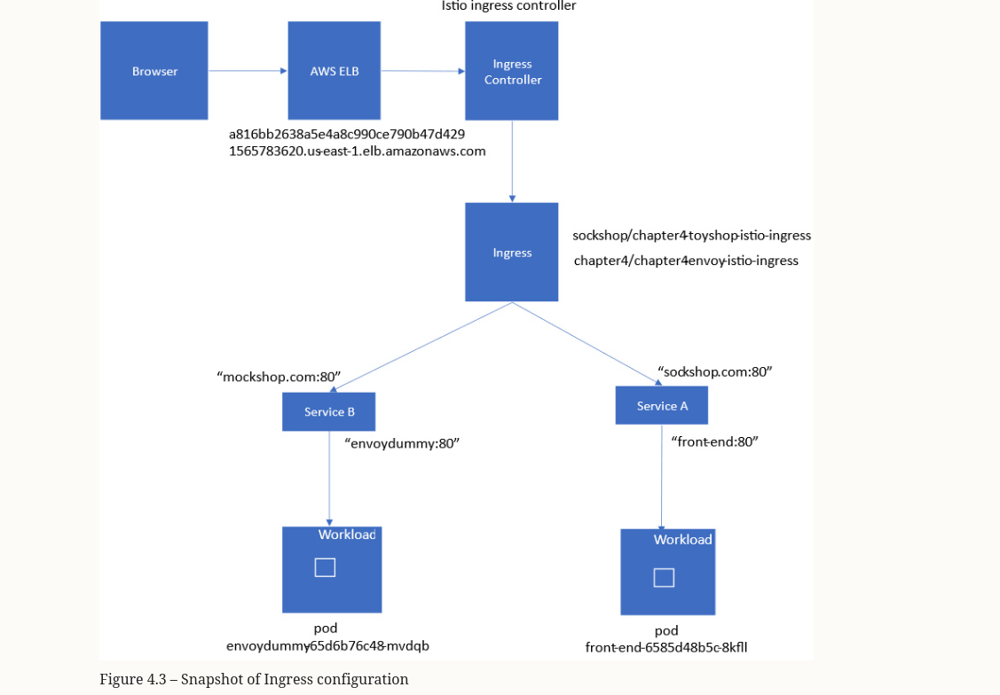
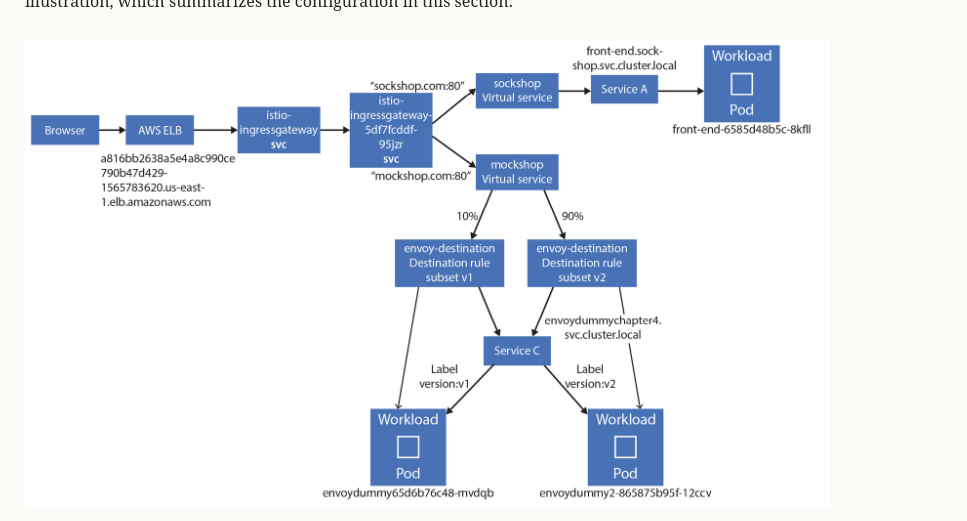
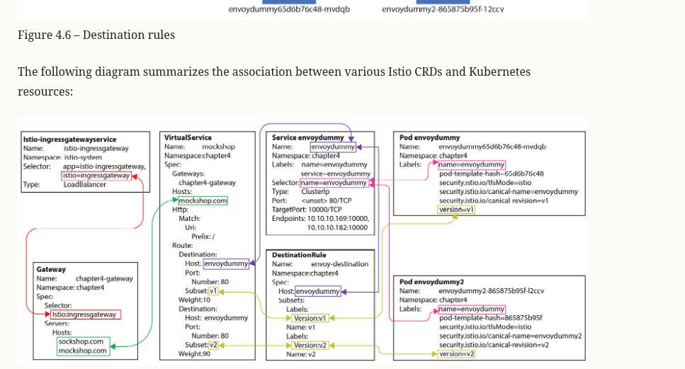
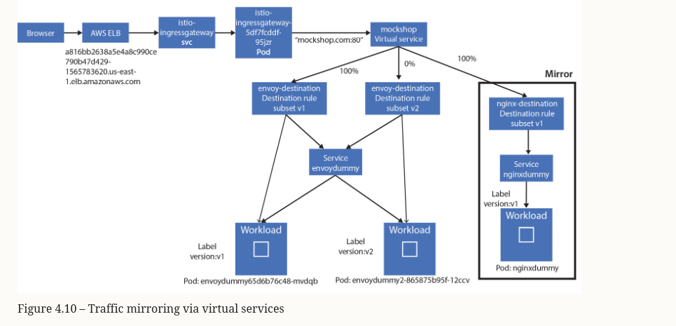

### Deploying sockshop

git clone https://github.com/microservices-demo/microservices-dem


### Execute

kubectl apply  -f microservices-demo/deploy/kubernetes/manifests/00-sock-shop-ns.yaml 

kubectl create -f  sockshop/devops/deploy/kubernetes/manifests/* -n sock-shop


### We will modify the frontend that is currently using the NodePort to access via Ingres

 kubectl apply -f ingress.yaml


### Create namespace

	kubectl create ns chapter4
	kubectl label namespace chapter4 istio-injection=enabled --overwrite
	kubectl create configmap envoy-dummy --from-file=../chapter3/envoy-config-1.yaml


### Create new ingress 2-istio-ingress.yaml

  kubectl apply -f 2-istio-ingress.yaml
  


### We prefer to use Gateway instead of ingress

 Istio Gateway is like a load balancer running at the edge of the mesh receiving incoming or outgoing HTTP/TCP connections. It configures exposed ports, protocols, etc. Istio Gateway also supports traffic management features such as load balancing, routing, authentication, and authorization.

### Remove the ingress

      kubectl delete -f 2-istio-ingress.yaml
      kubectl delete -f ingress.yaml

### Create the gateway


      kubectl apply -f 3-istio-gateway.yaml

### Traffic routing and canary release

    We will use DestinationRule for traffic routing and virtualService
    We will use another envoy-proxy.

Create a new config map for a new configuration for the envoyproxy

    kubectl create configmap envoy-dummy-2 --from-file=envoy-config-2.yaml -n chapter4

Create a new envoyproxy deployment and service

    kubectl apply -f 02-envoy-proxy.yaml

Now we will create another virtual host to select between the 2 versions

    kubectl apply -f 4a-istio-gateway.




    kubectl delete -f 4a-istio-gateway.yaml

### Traffic mirroring

    Is a technique that allows you to send a copy of production traffic to a test or staging environment. This is useful for testing new versions of your application before releasing them to production.


   The repo is: https://github.com/PacktPublishing/Bootstrap-Service-Mesh-Implementations-with-Istio/blob/main/Chapter4/4b-istio-gateway.yaml
   
   We will install nginx
   
    kubeclt apply -f nginx.yaml

   The we will modify the virtualService to mirror 100 from the envoy

    kubeclt apply -f 4b-istio-gateway.yaml

    curl -H "Host: mockshop.com" http://10.108.141.169 <IP OF THE LoadBalancer istio>

Clear the work
  
      kubectl delete -f 4b-istio-gateway.yaml
      kubectl delete -f nginx.yaml



### Routing traffic to service outside of the cluster.

    When you need to communicate with services outside the mesh you need to 
    tell istio where to find them. You can do this by creating a service entry.

```yaml

apiVersion: networking.istio.io/v1alpha3
kind: ServiceEntry
metadata:
  name: httpbin-svc
  namespace: chapter4
spec:
  hosts:
  - httpbin.org
  location: MESH_EXTERNAL
  ports:
  - number: 80
    name: httpbin
    protocol: http
  resolution: DNS

```
In the ServiceEntry declaration, the following configurations are defined:

resolution: Here, we define how the hostname should be resolved; the following are the possible values:
DNS: Makes use of available DNS to resolve the hostname
DNS_ROUND_ROBBIN: In this case, the first resolved address is used
NONE: No DNS resolution is required; the destination is specified in form of an IP address
STATIC: Uses a static endpoint against the hostnames
location: The service entry location is used to specify whether the requested service is part of the mesh or outside the mesh. Possible values are MESH_EXTERNAL and MESH_INTERNAL.
hosts: This is the hostname associated with the service being requested; in this example, the host is httpbin.org. The host field in ServiceEntry is matched with host fields specified in virtual service and destination rules.

    kubectl apply -f 5a-istio-service-entry.yaml

    curl -H "Host: mockshop.com" http://10.108.141.169/get

### Exposing Ingress over HTTPS

Create CA
openssl req -x509 -sha256 -nodes -days 365 -newkey rsa:2048 -subj '/O=Sockshop Inc./CN=Sockshop.inc' -keyout Sockshop.inc.key -out Sockshop.inc.crt

Create CSR and key

$openssl req -out sockshop.com.csr -newkey rsa:2048 -nodes -keyout sockshop.com.key -subj "/CN=sockshop.com/O=sockshop.inc"

Sign the CSR

$openssl x509 -req -sha256 -days 365 -CA Sockshop.inc.crt -CAkey Sockshop.inc.key -set_serial 0 -in sockshop.com.csr -out sockshop.com.crt

Add the secret to the istio

kubectl create -n istio-system secret tls sockshop-credential --key=sockshop.com.key --cert=sockshop.com.crt


curl -v -k -HHost:sockshop.com --resolve  "sockshop.com:32431:192.168.59.100" https://sockshop.com:32431
    for minikube we need to use minikube ip, then the port mapped to the 443 for the ingress gateway

kubectl delete -f 6-istio-gateway.yaml

#### Redirect http to https

For testing we use the nodePort of the minikube ip and the port 80 of the istio-ingressgateway

curl -v -k -HHost:sockshop.com --resolve  "sockshop.com:31672:192.168.59.100" http://sockshop.com:31672

for cloud

curl -v -HHost:mockshop.com --connect-to "mockshop.com:443:a816bb2638a5e4a8c990ce790b47d429-1565783620.us-east-1.elb.amazonaws.com" --cacert Sockshop.inc.crt  https://mockshop.com/


kubectl apply -f 7-istio-gateway.yaml

### Enabling HTTPS for multiple hosts
openssl req -out mockshop.com.csr -newkey rsa:2048 -nodes -keyout mockshop.com.key -subj "/CN=mockshop.com/O=mockshop.inc"
openssl x509 -req -sha256 -days 365 -CA Sockshop.inc.crt -CAkey Sockshop.inc.key -set_serial 0 -in mockshop.com.csr -out mockshop.com.crt
kubectl create -n istio-system secret tls mockshop-credential --key=mockshop.com.key --cert=mockshop.com.crt

curl -v -HHost:sockshop.com --resolve "sockshop.com:32431:192.168.59.100" --cacert Sockshop.inc.crt https://sockshop.com:32431/

curl -v -HHost:mockshop.com --resolve "mockshop.com:32431:192.168.59.100" --cacert Sockshop.inc.crt  https://mockshop.com:32431/

Remember the CA handler for the certificates!!!!

kubectl apply -f 8-istio-gateway.yaml

### Enablind HTTPS for CNAM and wilcards records

openssl req -out sni.sockshop.com.csr -newkey rsa:2048 -nodes -keyout sni.sockshop.com.key -subj "/CN=*.sockshop.com/O=sockshop.inc"


Sign with the CA
openssl x509 -req -sha256 -days 365 -CA Sockshop.inc.crt -CAkey Sockshop.inc.key -set_serial 0 -in sni.sockshop.com.csr -out sni.sockshop.com.crt

Add to the istio-system namespace

kubectl create -n istio-system secret tls sni-sockshop-credential --key=sni.sockshop.com.key --cert=sni.sockshop.com.crt

kubectl apply -f 9-istio-gateway.yaml

curl -v -HHost:my.sockshop.com --resolve "my.sockshop.com:32431:192.168.59.100" --cacert Sockshop.inc.crt  https://my.sockshop.com:32431
